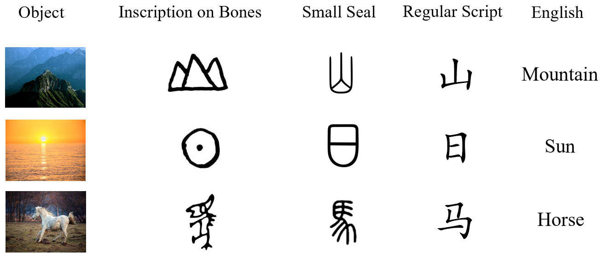

***  

# GlyphBERT
[English version](https://github.com/HITsz-TMG/GlyphBERT/blob/master/readme_en.md)  

这个项目页面是关于哈工大(深圳) TMG课题组对于GlyphBERT的pytorch代码实现。

[GlyphCRM: Bidirectional Encoder Representation for Chinese Character with its Glyph](https://arxiv.org/pdf/2107.00395.pdf)


***

## Introduction：  


汉字的字形在许多情况下可以传达其意义，而具有相似结构的汉字也具有内在的联系。它们直观的表明，汉字的符号特征具有增强其表达能力的潜力。
  

GlyphBERT是一个包含了汉字字形特征中文预训练模型。它通过将输入的字符渲染成图像并设计成多通道位置特征图的形式，并设计了一个两层
残差卷积神经网络模块来提取字符的图像特征进行训练。  

实验结果证明，通过融合汉字字形的特征能够很好的提升预训练模型的性能，GlyphBERT在多个下游任务上大大优于BERT的性能，并且具有很强的可迁移性。

***


## Environment Requirements:  
torch~=1.10.1+cu111  
tqdm~=4.64.0  
transformers~=4.5.1  
Pillow~=8.2.0  
torchvision~=0.11.2  
typing~=3.7.4.3  
packaging~=20.9  
nltk~=3.6.1  

[HuggingFace Checkpoint](https://huggingface.co/HIT-TMG/GlyphCRM)
其中，我们所提供的模型参数所包括了一个pytorch_bin.pt,它包含了:  
+ "config": 预训练时使用的config,  
+ "training_state": 预训练相关的存档点状态与说明,  
+ "model": GlyphBERT模型参数 (必要)
***  

## 快速进行Finetune: 

***

以ChnSenti情感分类任务为例：  

所处理好的数据集文件结构是
```bash
glyphCRM/
├── data
│   └── downstream_data
│      └── senti_raw_data.json
```

将数据处理成这样的形式，可以在不修改dataset类读取数据的情况下直接进行finetune。  

以ChnSenti为例，需要将输入的数据预处理为List[data1, data2, xxxxxxx, datan]的形式。每条列表的数据项以字典的形式储存，需要包含"input_ids"和"label"两个字段。
```bash
[  
{"input_ids": ["[CLS]", "珠", "江", "花", "园",  "服", "务", "吗", "，", "一", "般", "[SEP]"], "label": 1},   
]  
```
***  

通过修改或传入classification_config.py脚本中的重要参数进行调试，一个运行finetune脚本的例子:  
```bash
python classification.py --dataset_name chnsenti --pretrained_model_path ./pretrained_model/save/pytorch_model.pt --epoch 10 --lr 3e-5 --num_labels 2 --vocab_path ./data/vocab.txt --bmp_path ./data/bmp48/  
```
其中一些重要参数名字与作用:  
```bash
--dataset_name: 需要参考classification_config.py中，将处理好的数据进行路径设置，将预处理好的数据放在指定的位置，并以dataset_name来代指它。  
--pretrained_model_path: 读取的state_dict所在位置  
--epoch: 训练轮数
--lr: 学习率
--num_labels: 分类任务的标签数
--vocab_path: 预训练模型的词表
--bmp_path: 与词表一一对应的bmp图像
```
更多可调节的参数请参考classification_config.py脚本。

***

##引用  

@article{DBLP:journals/corr/abs-2107-00395,
  author    = {Yunxin Li and
               Yu Zhao and
               Baotian Hu and
               Qingcai Chen and
               Yang Xiang and
               Xiaolong Wang and
               Yuxin Ding and
               Lin Ma},
  title     = {GlyphCRM: Bidirectional Encoder Representation for Chinese Character
               with its Glyph},
  journal   = {CoRR},
  volume    = {abs/2107.00395},
  year      = {2021},
  url       = {https://arxiv.org/abs/2107.00395},
  eprinttype = {arXiv},
  eprint    = {2107.00395},
  timestamp = {Wed, 27 Jul 2022 14:45:04 +0200},
  biburl    = {https://dblp.org/rec/journals/corr/abs-2107-00395.bib},
  bibsource = {dblp computer science bibliography, https://dblp.org}
}
