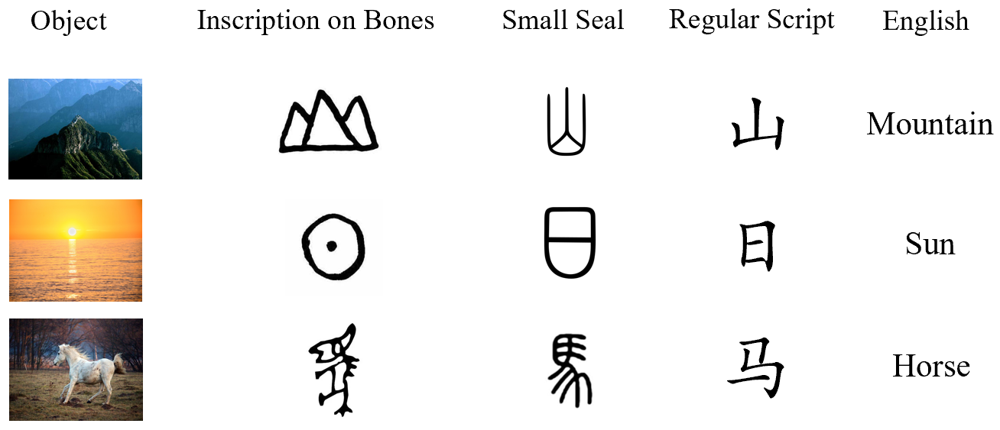

# GlyphBERT
[中文版](https://github.com/HITsz-TMG/GlyphBERT/blob/master/readme.md)  

This project page is about the pytorch code implementation of GlyphBERT by the HITsz-TMG research group.

[GlyphCRM: Bidirectional Encoder Representation for Chinese Character with its Glyph](https://arxiv.org/pdf/2107.00395.pdf)


***

## Introduction：  


The glyphs of Chinese characters can convey some meanings in many cases, and Chinese characters with similar structures can have intrinsic links.   
They intuitively indicate that the glyph features of Chinese characters have the potential to enhance their representations.
  

GlyphBERT is a Chinese pre-training model that includes Chinese character glyph features.It renders the input characters into images and designs them in the form of multi-channel location feature maps, and designs a two-layer residual convolutional neural network module to extract the image features of the characters for training.

The experimental results show that the performance of the pre-training model can be well improved by fusing the features of Chinese glyphs. GlyphBERT is much better than BERT in multiple downstream tasks, and has strong transferability.

***


## Environment Requirements:  
torch~=1.10.1+cu111  
tqdm~=4.64.0  
transformers~=4.5.1  
Pillow~=8.2.0  
torchvision~=0.11.2  
typing~=3.7.4.3  
packaging~=20.9  
nltk~=3.6.1  

Our pre-trained model parameters are placed on huggingface:  [HuggingFace Checkpoint](https://huggingface.co/HIT-TMG/GlyphCRM)  
The model parameters we provide include a pytorch_bin.pt, which contains:
state_dict:  
+ "config": the config of pretraining,  
+ "training_state": the training state of pretraining,  
+ "model": GlyphBERT's parameters (essential)

***
## A example to Finetune GlyphBERT: 

***

Take the ChnSenti sentiment classification task as an example:：  

The preprocessed dataset file structure is
```bash
glyphCRM/
├── data
│   └── downstream_data
│      └── senti_raw_data.json
```

By processing the data into such a form, finetune can be performed directly without modifying the dataset class to read the data.    

The input data needs to be preprocessed into the form of List[data1, data2, xxxxxxx, datan]. The data items of each list are stored in the form of a dictionary, which needs to contain two fields "input_ids" and "label".
```bash
[  
{"input_ids": ["[CLS]", "珠", "江", "花", "园",  "服", "务", "吗", "，", "一", "般", "[SEP]"], "label": 1},   
]  
```
***  

Running by passing important parameters in the classification_config.py script. An example of running the finetune script:  
```bash
python classification.py --dataset_name chnsenti --pretrained_model_path ./pretrained_model/save/pytorch_model.pt --epoch 10 --lr 3e-5 --num_labels 2 --vocab_path ./data/vocab.txt --bmp_path ./data/bmp48/  
```
Some of the important parameters:  
```bash
--dataset_name: Refer to classification_config.py, set the path of the processed data, put the preprocessed data in the specified location, and refer to it with dataset_name.  
--pretrained_model_path: The model parameter path 
--epoch: training epoch
--lr: Training learning rate
--num_labels: Number of labels of classification task
--vocab_path: The path of vocab.txt
--bmp_path: bmp images one-to-one corresponding to the vocabulary
```
For other parameters, please refer to the classification_config.py script.

***

